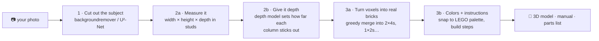
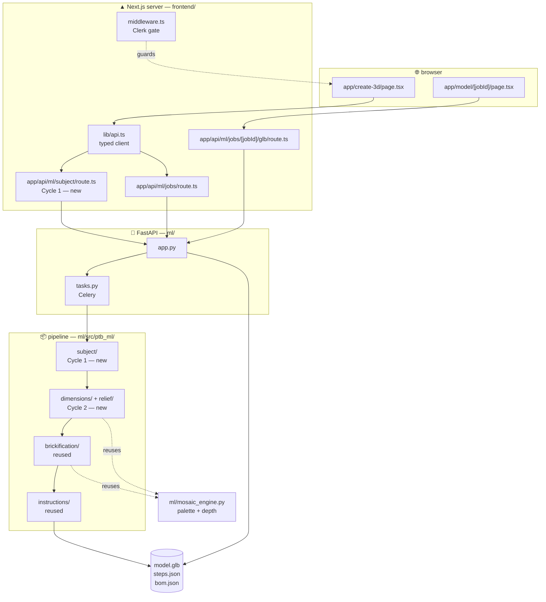

# Purpix BrickLab

Turn a photo of a building into a buildable LEGO®-style model — with step-by-step instructions and a
shopping list of bricks.

> Auburn University · COMP 4710 Senior Design · Team #16
> An Dinh · Christos Argyropoulos · Carlos Oceguera · Sponsor: Leal "Al" Smith, Purpix Media LLC

---

## What it does

You upload a photo. We cut the subject out of its background, work out how tall/wide/deep it is, turn it
into a 3D shape made of LEGO bricks in real LEGO colors, and hand you back a 3D model you can spin around,
a step-by-step build manual, and a parts list you can actually buy.

## How it works



**In plain terms, one step at a time:**

1. **Cut out the subject.** A background-removal model finds the building and erases everything else, so
   the sky and the neighbor's car don't end up as bricks.
2. **Measure it.** From the cut-out shape we work out proportions — how wide and tall it is — and convert
   that into a stud count that fits the model size you picked (Small / Medium / Large).
3. **Give it depth.** A depth-estimation model looks at the photo and estimates how far away each part of
   the building is. A porch that sticks out becomes bricks that stick out. This is what makes the result a
   *3D shape* rather than a flat pixel picture.
4. **Turn it into real bricks.** The shape starts as a grid of 1×1 cubes. A placement algorithm merges
   them into real LEGO pieces — 2×4s, 1×2s — the way you'd actually build it, staggering the seams so it
   holds together.
5. **Color and instruct.** Each brick gets the closest real LEGO color, and the model is sliced into
   bottom-up build steps with a parts list.

## Project status

| Cycle | Goal | Status |
|:--|:--|:--|
| **0** | Repo foundation — import previous team's work, document it, set up docs & licensing | ✅ **Done** |
| **1** | Subject isolation + background removal | ⬜ Not started |
| **2** | 2D → dimensions → bas-relief 3D model | ⬜ Not started |
| **3** | Color refinement, brick stability, instructions + parts list | ⬜ Not started |

**Non-functional targets:** end-to-end generation in **≤ 300 seconds**; models buildable from a
**limited brick palette** with a configurable piece-count budget (minimum ~20 pieces).

## Repository layout

```
bricklab/
├── frontend/                    Next.js 16 · React 19 · Tailwind · Three.js
│   ├── app/
│   │   ├── page.tsx               landing
│   │   ├── create/                2D Mosaic Studio  ← the "Pixel/Mosaic" style
│   │   ├── create-3d/             upload → poll → 3D  ← Cycle 1 & 2 UI lands here
│   │   ├── build/[id]/            mosaic result: parts list, build guide
│   │   ├── model/[jobId]/         GLB viewer  ← Cycle 3 adds tabs
│   │   ├── my-builds/ gallery/ pricing/ faq/
│   │   └── api/                   proxy routes — the browser never calls FastAPI directly
│   ├── components/                GlbViewer · MosaicViewer3D · Navbar · ui/
│   ├── lib/                       mosaic.ts (palette) · depth.ts · api.ts · builds.ts
│   ├── middleware.ts              Clerk auth gate ⚠️ blocks /create-3d without keys
│   └── public/                    landing images, demo GLTF
│
├── ml/                          Python · FastAPI · Celery
│   ├── app.py                     HTTP endpoints
│   ├── tasks.py                   Celery background jobs
│   ├── mosaic_engine.py           LEGO palette · dithering · depth-aware quantize
│   ├── main.py                    CLI entrypoint
│   ├── db.py · storage.py · auth.py
│   └── src/ptb_ml/
│       ├── brickification/        ✅ voxels → real bricks + BOM     REUSED
│       ├── instructions/          ✅ GLB + build steps              REUSED
│       ├── voxelization/          ◐  LEGO grid fitting (settings reused, loader bypassed)
│       ├── preprocess/            💤 frame extraction, masking
│       ├── sfm/ · sfm_qc/         💤 COLMAP structure-from-motion
│       ├── priors/                💤 needs DSINE — cannot run, see docs/THIRD_PARTY.md
│       ├── shape_completion/      💤 Open3D TSDF fusion
│       └── pipeline/              💤 orchestrates the dormant chain
│
├── docs/                        PREVIOUS_TEAM · DECISIONS · THIRD_PARTY
├── compose.yaml                 frontend + fastapi + worker + postgres + redis
└── LICENSE                      placeholder — see docs/THIRD_PARTY.md
```

✅ actively reused · ◐ partly reused · 💤 dormant (the previous team's photogrammetry
path — kept in-tree as the future "walk around your house" feature, not used by our cycles)

## How the folders connect

One upload, traced through every file it touches. The browser never calls FastAPI
directly — it always goes through a Next.js proxy route.



**Reading it:** `create-3d` calls a typed function in `lib/api.ts`, which hits a Next
proxy route, which forwards to `ml/app.py`. Long work is handed to a Celery task that
walks the pipeline modules left to right. The two new Cycle 1–2 modules feed the two
modules we inherited unchanged. `mosaic_engine.py` is shared by both new stages — it
owns the LEGO palette and the depth model.

## Running it

BrickLab is not deployed. It runs on your machine at <http://localhost:3000>.

### Setup — required once

Sign-in is handled by Clerk. The sponsor has provided credentials; **nobody has
signed in and generated the keys yet**, so the app will not start until someone does.

Create `frontend/.env.local` (gitignored — never commit it):

```
NEXT_PUBLIC_CLERK_PUBLISHABLE_KEY=pk_test_...
CLERK_SECRET_KEY=sk_test_...
```

Until that file exists, `docker compose up` exits immediately (`compose.yaml`
requires it) and `npm run dev` fails on the missing publishable key.

### Method 1 — everything (frontend + ML)

**Needs:** Docker Desktop. Use whenever you change `ml/`.

```bash
docker compose up --build
```

```
frontend   :3000   web app
fastapi    :8000   Python ML API
worker             background jobs (Celery)
postgres   :5432   job records
redis      :6379   job queue
```

First build takes roughly 10–20 minutes — it bakes the depth model (~100 MB) into
the image. Later builds reuse that layer.

```bash
docker compose logs -f fastapi   # watch the ML service
docker compose down              # stop everything
```

### Method 2 — web app only

**Needs:** Node.js 20.9+. Use for pages, styling, and components.

```bash
cd frontend && npm install && npm run dev
```

Starts in seconds with hot reload. **Anything calling the ML service will not work** —
background removal, 3D generation, the depth viewer. Those need Method 1, or at
minimum the FastAPI container on port 8000.

### Previous team's deployment

<https://main.d2hnowa3ob8fvm.amplifyapp.com/> — a visual reference for the inherited
UI, not a dev environment. It is their AWS account and frontend-only: Amplify hosts no
Python backend, so ML routes return `503`. The 2D mosaic works there because it runs
entirely in the browser.

## Documentation

| Doc | What's in it |
|---|---|
| [`docs/PREVIOUS_TEAM.md`](docs/PREVIOUS_TEAM.md) | What we inherited, what works, what's broken, and a file-by-file keep/drop inventory |
| [`docs/DECISIONS.md`](docs/DECISIONS.md) | Running log of technical decisions and why we made them |
| [`docs/THIRD_PARTY.md`](docs/THIRD_PARTY.md) | Open-source licenses — **read before adding a dependency or swapping a model** |
| [`HANDOFF_NOTES.md`](HANDOFF_NOTES.md) | The previous team's own handoff notes (kept verbatim) |

## Credits

Built on work by the previous senior design team
([`Aleonawork/AIPurpixBrickLab`](https://github.com/Aleonawork/AIPurpixBrickLab)), shared by our sponsor.

LEGO® is a trademark of the LEGO Group, which does not sponsor, authorize, or endorse this project.
