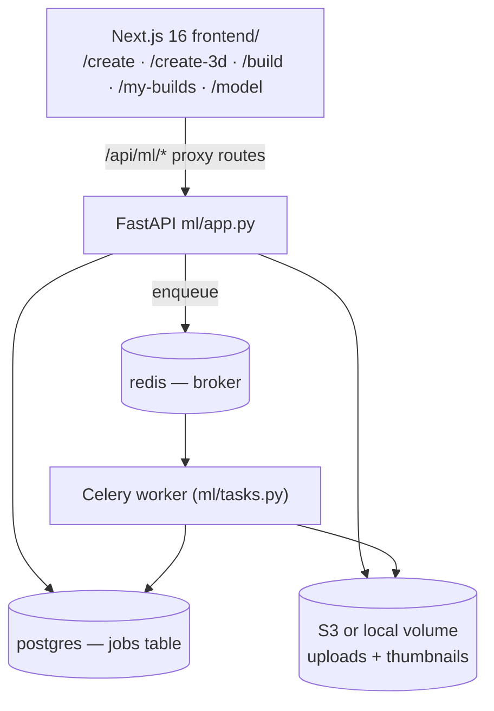

# What the Previous Team Built

Reference notes on the code we inherited, imported at commit `4ce3d19` from
[`Aleonawork/AIPurpixBrickLab`](https://github.com/Aleonawork/AIPurpixBrickLab) @ `5d9cbf5`.

Sponsor Leal "Al" Smith shared this source with us expressly to build on (report §8, meeting 8.27.2026).

**Why this document exists:** report §6 names "working with material from a previous team" as our top
risk, and §7 names understanding it as our biggest challenge so far. This is the mitigation — a written,
shared understanding of what we inherited, what works, and what is quietly broken.

---

## 1. High-level architecture

Five services in `compose.yaml`: `frontend` (:3000), `fastapi` (:8000), `worker` (Celery), `postgres`
(:5432), `redis` (:6379).

## 2. Two features, very different maturity

| Feature | Route | Where it runs | Status |
|---|---|---|---|
| **2D Mosaic Studio** | `/create` → `/build/[id]` | Entirely in the browser (`frontend/lib/mosaic.ts`); optional server call for depth | ✅ **Works** |
| **3D Model Builder** | `/create-3d` → `/model/[jobId]` | Python pipeline in `ml/src/ptb_ml/` | ⚠️ **Library + CLI only — never wired to the web app** |

The 3D feature's UI is complete and polls a backend that does not exist. `frontend/app/api/ml/jobs/route.ts`
POSTs to `POST /api/jobs/3d`, but **`ml/app.py` has no such route** and `ml/tasks.py` has no 3D task. The
pipeline is only reachable via `python ml/main.py --job-id ... video.mp4`.

## 3. Their 3D approach was photogrammetry, not single-image

It needs a **video or 30–60 photos walking around the subject**:

```mermaid
flowchart LR
    IN["video / image set"] --> P1["preprocess<br/>ffmpeg frames, quality filter,<br/>pHash dedupe, sky+DeepLabv3 masking"]
    P1 --> P2["sfm<br/>COLMAP: features → match → mapper"]
    P2 --> P3["sfm_qc<br/>model_analyzer, score, route"]
    P3 --> P4["priors<br/>Depth Anything V2 + DSINE normals + seg"]
    P4 --> P5["shape_completion<br/>Open3D TSDF fusion → mesh"]
    P5 --> P6["voxelization<br/>fit to LEGO stud/plate grid"]
    P6 --> P7["brickification<br/>greedy brick placement + BOM"]
    P7 --> P8["instructions<br/>GLB + steps.json"]
```

Their only single-image "3D" is a **bas-relief** trick (`ml/scripts/generate_demo.py`, `POST /api/depth-grid`):
run monocular depth, extrude each mosaic pixel to a column height. That is 2.5D — a relief plaque — and it
emits **one 1×1×1 brick per voxel**, which is exactly the "mosaic look" our project is moving away from.

## 4. Color detection lives in three places

All three share the same LEGO palette concept but are **not** a single source of truth — worth unifying.

| File | Key functions | What it does |
|---|---|---|
| `frontend/lib/mosaic.ts` | `PALETTE` (22 colors), `gridDimsFor()`, `nearestPaletteIndex()`, `quantizeImage()`, `renderMosaic()` | Client-side. Draws the photo to a canvas at grid resolution (48/72/104 studs on the long edge), snaps each cell to the nearest palette color by squared RGB distance. |
| `ml/mosaic_engine.py` | `PALETTE_RGB` (22), `grid_dims_for()`, `depth_aware_quantize()`, `_nearest_palette_depth()`, `build_parts_list()`, `_get_depth_pipe()` | Server-side, richer. **Floyd–Steinberg dithering** plus a **depth bias** — far pixels are penalized for choosing saturated colors, so backgrounds go muted. |
| `ml/src/ptb_ml/brickification/colors.py` | `LEGO_COLORS` (**18**), `snap_to_lego_color()` | Snaps an averaged 3D voxel color to the nearest LEGO color. Used by the 3D path. |

⚠️ `mosaic_engine.py` has **22** colors, `colors.py` has **18**, and they are not the same list. 2D and 3D
output can therefore disagree on color. Reconciling them is a Cycle 3 task.

## 5. Why they used Docker

- **Native dependency hell.** The pipeline needs COLMAP (C++/CUDA), Open3D, PyTorch, ffmpeg, OpenCV, plus a
  vendored DSINE. Installing that identically across Windows/Mac/Linux laptops by hand is days of work.
- **Model caching in image layers.** Both Dockerfiles run a `pipeline('depth-estimation', ...)` at *build*
  time so the ~100 MB Depth Anything weights bake into a layer — first request is instant, rebuilds reuse it.
- **Multi-service orchestration.** One `docker compose up` brings up all five services on one network.
- **Two build profiles.** `Dockerfile.fastapi` is light (depth endpoint only, used daily);
  `Dockerfile.pipeline` is heavy (~6 GB, adds COLMAP + Open3D).
- **Deployment parity.** Amplify hosts the Next.js frontend; the FastAPI image ships to Railway/Render/Fly.

## 6. Defects we inherited

| # | Defect | Location | Status |
|---|---|---|---|
| 1 | Committed merge-conflict marker — Docker rejects it, so `compose up --build` failed outright | `ml/Dockerfile.fastapi:23` | ✅ **Fixed** in `c74d39d` |
| 2 | `POST /api/jobs/3d` does not exist; the 3D Builder UI polls nothing | `ml/app.py` | Open — Cycle 2 |
| 3 | Brick **stability checks commented out** — `_check_stagger()` and the support-ratio test in `_can_plce()`. The sponsor memo promises "optimizes structure for stability"; it is not implemented | `ml/src/ptb_ml/brickification/engine.py` | Open — Cycle 3 |
| 4 | Palette mismatch — 22 colors vs 18 (see §4) | `mosaic_engine.py` vs `brickification/colors.py` | Open — Cycle 3 |
| 5 | No LICENSE file anywhere in the original repo | — | See `docs/THIRD_PARTY.md` |
| 6 | Only `preprocess` has tests; everything SfM-and-later is untested | `ml/test/` | Ongoing |
| 7 | "blue" (fallback) pipeline route is a TODO; always runs the expensive "orange" path | `ml/src/ptb_ml/pipeline/run.py` | Won't fix — path is dormant |
| 8 | Typos in public identifiers (`_can_plce`, `grid_indicies`) | `brickification/`, `voxelization/` | Cosmetic |

## 7. What we excluded from the import

| Excluded | Size | Why |
|---|---|---|
| `ml/vendor/DSINE/` | 184 MB | **Licensed non-commercial** by Imperial College London — *"You may not use the Software for commercial purposes."* Used only by `priors/engine.py` in the dormant photogrammetry path. |
| `ml/demo.glb` | 24 MB | Generated output of `ml/scripts/generate_demo.py`; regenerate locally. |
| `ml/test/test_files/*.mp4` | 2.9 MB | Referenced by no test — `test_full.py` synthesizes its own video with ffmpeg. |
| `.gitmodules` | — | Pointed at the removed DSINE submodule. |

**Consequence:** `ml/src/ptb_ml/priors/` cannot run without DSINE. That is intentional — it belongs to the
photogrammetry path, which is dormant *and* could not be used commercially anyway. `ml/vendor/` is kept as
an empty directory so `pyproject.toml`'s `packages.find(where=["src","vendor"])` still resolves.

---

## 8. Element-by-element inventory

Verdicts are a **starting proposal for team discussion**, not decisions.
Keep = use as-is · Modify = keep and change · Drop = delete · **Discuss** = needs a team call.

### `frontend/app/` — pages

| Path | Verdict | Notes |
|---|---|---|
| `page.tsx` (landing) | Modify | Rebrand Purpix BrickLab; the marketing copy is the previous team's. |
| `layout.tsx` | Keep | Root layout + fonts. |
| `create/page.tsx` | Keep | 2D Mosaic Studio. Becomes the **"Pixel / Mosaic" style** option from our user story. |
| `create-3d/page.tsx` | **Modify** | Upload + 3 s polling + elapsed timer already built. Cycle 1 adds the cut-out preview; Cycle 2 adds S/M/L and style selectors. |
| `build/[id]/page.tsx` | Keep | Result page: before/after toggle, per-color build guide, parts list. Reuse the parts-list section in Cycle 3. |
| `model/[jobId]/page.tsx` | **Modify** | GLB viewer page. Cycle 3 adds the 3D / Instructions / Parts-list tabs. |
| `my-builds/page.tsx` | Keep | localStorage build gallery. |
| `gallery/page.tsx` | **Discuss** | Marketing page — do we need it this semester? |
| `pricing/page.tsx` | **Discuss** | Depends on the sponsor's commerce timeline; no backend behind it. |
| `faq/page.tsx` | **Discuss** | Static content, low value right now. |

### `frontend/app/api/` — proxy routes

| Path | Verdict | Notes |
|---|---|---|
| `api/ml/depth-grid/route.ts` | Keep | Feeds the bas-relief viewer. |
| `api/ml/jobs/route.ts` | **Modify** | Already POSTs to `/api/jobs/3d`; Cycle 2 makes that endpoint real. |
| `api/ml/jobs/[jobId]/route.ts` | Keep | Status polling. |
| `api/ml/jobs/[jobId]/glb/route.ts` | Keep | GLB download proxy. |
| `api/ml/mosaic/route.ts` | Keep | Server-side mosaic. |
| `api/jobs/*`, `api/builds/*` | **Discuss** | Tied to Postgres + Clerk. See "infrastructure" below. |

### `frontend/components/`

| Path | Verdict | Notes |
|---|---|---|
| `GlbViewer.tsx` | **Keep** | Three.js GLB viewer — orbit, shadows, ACES tone mapping. Used directly in Cycle 2. |
| `MosaicViewer3D.tsx` | **Keep** | `InstancedMesh` brick viewer with per-color highlight and depth-driven heights. |
| `Navbar.tsx` | Modify | Rebrand; prune links for dropped pages. |
| `ui/{button,card,badge,accordion}.tsx` | Keep | shadcn primitives. |

### `frontend/lib/`

| Path | Verdict | Notes |
|---|---|---|
| `mosaic.ts` | **Keep** | The palette + quantizer. Core reusable asset. |
| `depth.ts` | Keep | Thin fetch wrapper for the depth endpoint. |
| `builds.ts` | Keep | localStorage build store. |
| `api.ts` | Modify | Extend for the new 3D job endpoints. |
| `utils.ts` | Keep | `cn()` helper. |

### `frontend/public/`

| Path | Verdict | Notes |
|---|---|---|
| `Frontpagehouse.png` (7.6 MB), `HouseToLego.png` (2.2 MB), `HouseBrickSet.png` (2.1 MB) | **Modify** | Keep the imagery, but compress — 12 MB of PNGs on the landing page is a real load cost. |
| `models/LegoTest/scene.gltf` (11 MB) + `viewer.js` | **Discuss** | Loaded by `create/page.tsx` via `<Script src="/viewer.js">`. 11 MB for a decorative demo model — replace with something lighter or drop. |
| `logo.png`, `logobackgroundremoved.png`, svg icons | Modify | Rebrand. |

### `ml/` — Python service

| Path | Verdict | Notes |
|---|---|---|
| `mosaic_engine.py` | **Keep** | Palette, dithering, depth-aware quantize, cached depth pipeline. Cycle 2 reuses `depth_aware_quantize()` and `_get_depth_pipe()` directly. |
| `src/ptb_ml/brickification/` | **Keep + extend** | `run_brickification()` merges voxels into real brick shapes. **This is what stops our output from being 1×1 mosaic.** Cycle 3 re-enables stability. |
| `src/ptb_ml/instructions/` | **Keep + extend** | `glb_builder.build_glb()` + `steps.json`. Cycle 3 adds layer PNGs and the PDF manual. |
| `src/ptb_ml/voxelization/` | **Discuss** | `_load_tsdf()` is COLMAP/TSDF-specific. Cycle 2 writes the occupancy `.npz` directly and bypasses this module. Keep the settings (stud/plate sizes, S/M/L grid caps). |
| `app.py` | **Modify** | Add `/api/subject/preview` (Cycle 1) and `/api/jobs/3d` (Cycle 2). |
| `tasks.py` | **Modify** | Add the relief job alongside `run_mosaic_job`. |
| `main.py` | **Modify** | Add a single-image entrypoint. |
| `src/ptb_ml/{preprocess,sfm,sfm_qc,priors,shape_completion,pipeline}/` | **Dormant** | The photogrammetry path. Keep in-tree — it's the future "walk around your house" premium feature — but it cannot run without DSINE and could not ship commercially with it. |
| `db.py`, `storage.py`, `auth.py` | **Discuss** | See infrastructure below. |
| `Dockerfile.pipeline` | Dormant | Only needed for the COLMAP path. |

### Infrastructure — one call to make together

Clerk auth, Postgres, Redis, Celery, and S3 are all wired up and working, but they are heavy for a
CPU-only prototype whose main risk is ML throughput. **Options:** (a) keep as-is — it's already built and
matches production; (b) swap to a filesystem job store and drop Postgres/Redis/Celery from `compose.yaml`
for local dev, keeping the code path. Recommend deciding before Cycle 2 wires the job endpoints.
